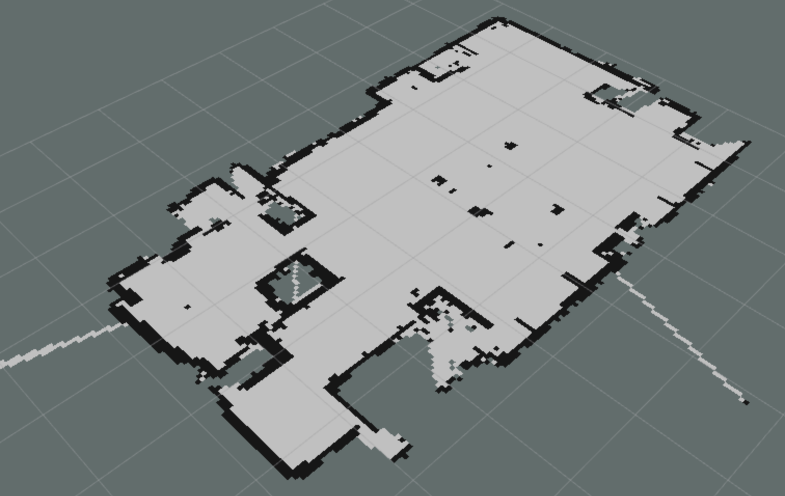
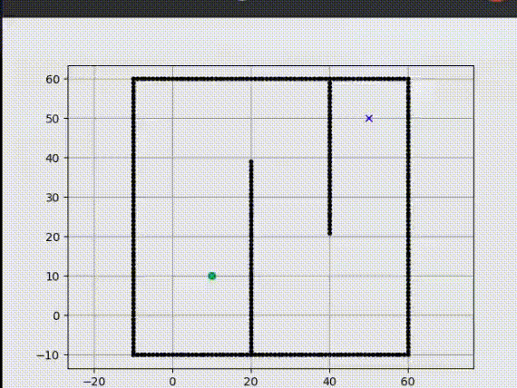
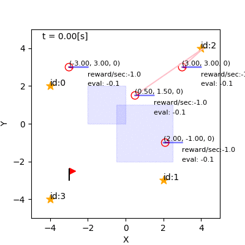

<!-- footer: 千葉工業大学・松本工業高校連携授業 -->

# 移動ロボット入門

千葉工業大学 上田 隆一

This work is licensed under a <a rel="license" href="http://creativecommons.org/licenses/by-sa/4.0/">Creative Commons Attribution-ShareAlike 4.0 International License</a>.

---

<!-- paginate: true -->

## 自己紹介

- 上田隆一という名前です
- ロボットの研究者です
- 長くなるので[続きはウェブで](https://ja.wikipedia.org/wiki/上田隆一)

---

## 宣伝: 本買って

- 左から順に
    - Linuxの本
    - ロボットの本（今日話する内容）
    - ロボットで使う数学の本

    

---

## 今日のテーマ

- 知能ってなんだろ？

---

## ある問題

- 登場人物（人物じゃないけど）
    - うちの猫様
    - 美味しいおやつ
    - 通路・扉
        - 扉は猫には開けられません
- 猫様はおやつまでたどり着けるだろうか？

---

## 答え: できない

- 扉の下に手を突っ込んでガリガリして諦める

<iframe width="560" height="315" src="https://www.youtube.com/embed/JmONWX1IWAk?si=kmL8VdtQict3X7Rn" title="YouTube video player" frameborder="0" allow="accelerometer; autoplay; clipboard-write; encrypted-media; gyroscope; picture-in-picture; web-share" referrerpolicy="strict-origin-when-cross-origin" allowfullscreen></iframe>

---

## ここで質問

- 人間なら簡単なのに猫には難しいのはなんで？
- 逆に言うと、おやつのところまで行くには何が必要？
    - 人間は何をしている？
    - 脳にどんな機能が必要？

---

## 答えあわせ

- 俯瞰ができていない（疑惑）
    - 猫の頭の中に地図はあるだろうか？
    - 自分の見ている風景が地図のどこに相当するか理解できてる？
- 計画ができていない（これは確実）
    - 頭の中でおやつの場所に行くまでの手順が思い浮んでない

---

## 問題を難しくすると 人間にも難しい

- 複雑な迷路だと人間にも大変
- 迷路でなく人生だと？
    - 俯瞰できないから遊んでしまう
    - 俯瞰している親や先生の言うことを素直に聞かない
- 注意
    - 息抜きは大事・聞きすぎも問題
    - 親も先生も完全には俯瞰できてない

---

## 無駄話はこれまで

- 今の話をふまえると自分で考えるロボットをどう作ればよいでしょう？どうしたらロボットが自分で仕事ができるようになる？
    - 具体性もない（達成までの計画もない）のに「人を助けるロボットを作りたい」とか目を輝かせて夢みたいなことを無責任に言ってませんか？

いっしょに考えていきましょう

---

## ・・・といいつつ最後の無駄話

- 「地図」を頭に持っている動物がいる
    - 特定のところに行くと反応するようになる場所細胞
       - 自分の見ているものや動きの感覚（主観）を「場所」という客観的なものに変換
- 他，移動や環境の形状に反応する脳細胞が存在

出典: 場所細胞: Stuartlayton at English Wikipedia, CC BY-SA 3.0, via Wikimedia Commons, https://commons.wikimedia.org/wiki/File:Boundary_cell.png. 格子細胞: Khardcastle, CC BY-SA 4.0, via Wikimedia Commons, https://commons.wikimedia.org/wiki/File:Autocorrelation_image.jpg. ボーダー細胞: Tom Hartley, Colin Lever, Sarah Stewart, CC BY-SA, via Wikimedia Commons, https://commons.wikimedia.org/wiki/File:Boundary_cell.png

---

## 移動ロボットの話

- 本題です
- とりあえず次のような問題を考える
   - ロボットがどこかに置かれる
       - 右図のようなやつ
   - ゴールがどこかロボットに教えられる
   - ロボットが自分でゴールまで行く

---

## 移動ロボットのハードウェア

---

## 地図づくり

- ロボットを人間が操作してロボットのセンサでセンシング
- ずれないようにつなげていく
    （コンピュータに計算させて自動で）
        <iframe width="560" height="315" src="https://www.youtube.com/embed/b2kYQ11PUSI?si=3VsJxUuX92oP6DZT" title="YouTube video player" frameborder="0" allow="accelerometer; autoplay; clipboard-write; encrypted-media; gyroscope; picture-in-picture; web-share" referrerpolicy="strict-origin-when-cross-origin" allowfullscreen></iframe>
- 右図: できた地図

---

## 地図づくり（おまけ）

- 地図が歪んで作られて、修正される様子
    - [ずれている: 12:49ごろ](https://youtu.be/jS5_a9BW2zI?si=0JT8wF6IS8fOH1Yw&t=769)
    - [なおっている: 13:16ごろ](https://www.youtube.com/watch?v=jS5_a9BW2zI&t=796s)

<iframe width="560" height="315" src="https://www.youtube.com/embed/jS5_a9BW2zI?si=0JT8wF6IS8fOH1Yw" title="YouTube video player" frameborder="0" allow="accelerometer; autoplay; clipboard-write; encrypted-media; gyroscope; picture-in-picture; web-share" referrerpolicy="strict-origin-when-cross-origin" allowfullscreen></iframe>

---

## 大きな地図の例

- 千葉工大の学内の地図
    - 左: 2次元のLiDARで作成
    - 右: 3次元のLiDARで作成
        - いずれもロボットを手動で走らせて作成、200m×300m

---

## 地図作成の方法

1. ロボットを円軌道で動かして、センサで見つけた星の位置を記録（左図）
（桃色の線分の先端）
    - 実際にはロボットの経路は歪むので先端が揃わない
2. 星の位置が揃う軌道を推定$\rightarrow$改めて星の位置を記録（右図）
- 言葉で説明すると簡単だけど数学は難しい$\rightarrow$[大学の講義資料1](https://ryuichiueda.github.io/LNPR_SLIDES/chap9_1.html)、[大学の講義資料2](https://ryuichiueda.github.io/LNPR_SLIDES/chap9_2.html)

　　　

---

## 地図のなかでの位置計算

- よく使われる方法
    1. 地図のなかにロボットの分身をたくさんばらまく
    2. ロボットが動いたら分身も動かす
    3. センサのデータが入ったら、データと合わないところにいる分身を消す
        - 右図はLiDARではなくカメラで星を見たときの例
- 確率の計算となる（[講義資料](https://ryuichiueda.github.io/slides_marp/prob_robotics_2024/lesson7.html)）

---

## 位置計算しながら走るロボット

- 動画の見かた
    - 緑が「分身」、赤が推定位置を基準に地図に描いたLiDARのデータ
    - 経路は人間が与えている
- 動画のみどころ: ウェイポイント26〜27間で分身が広がる
    - 坂道 + 十字路のはずが工事中で地図とセンサからのデータに不整合

<iframe width="560" height="315" src="https://www.youtube.com/embed/Dgd2tOCEYno?si=f7AvpZpB1w-TfSS_&amp;start=2211" title="YouTube video player" frameborder="0" allow="accelerometer; autoplay; clipboard-write; encrypted-media; gyroscope; picture-in-picture; web-share" referrerpolicy="strict-origin-when-cross-origin" allowfullscreen></iframe>

---

## 目的地への移動

- どうすれば行けるでしょうか？
    - 様々な方法がある

---

## **r**apidly exploring **r**andom **t**ree（RRT）[LaValle1998]

- スタートあるいはゴール地点から枝をのばしていき、スタートとゴール地点を結ぶ経路を見つける手法
    - 移動ロボットではあまり使わないが、ロボットの腕のようにもっと複雑な制御対象によく使われる
- 右の例: [AtsushiSakai/PythonRobotics](https://github.com/AtsushiSakai/PythonRobotics)で作成
    - 障害物$\circ$のなかにある2つのxの間を緑の枝で接続

---

## A*[Pearl1984]などの探索手法

- スタートあるいはゴール地点からもう片方の地点を少しずつ探していく
    - なるべく早くゴールが見つかりそうな向きを優先させる
    - $\rightarrow$優先方法の違いで様々な手法
        - 途中が迷路みたいになっていると、どの手法もたいして違いが出ない

---

## もっと過激な方法[Ueda2023]

- 価値反復[Bellman1957]を利用
    - 全通りの位置や向きからゴールまでの時間を計算
        - 全部計算しないと正しい結果が出ないので
        - すごく時間がかかる$\rightarrow$高いコンピュータで制圧
    - 計算結果を使って時間が減る方向にロボットを誘導
- 例: 右図の環境で、水たまりを避けて🚩まで行く
    - 下図のように🚩から時間が決まっていく

---

## 価値反復で動くロボット

- 動く障害物も地図に取り入れて常に時間を計算
    - 効率よく確実に動く
    - ただしバッテリーがどんどん減る

<iframe width="560" height="315" src="https://www.youtube.com/embed/n7LXx50gl9g?si=4fcoDk3cdeUNf-uO" title="YouTube video player" frameborder="0" allow="accelerometer; autoplay; clipboard-write; encrypted-media; gyroscope; picture-in-picture; web-share" referrerpolicy="strict-origin-when-cross-origin" allowfullscreen></iframe>

---

## 最近の研究での話題

- end-to-end学習
    - カメラやLiDARで何かを見せて人工ニューラルネットワークに決めさせる
        - 人工ニューラルネットワーク: 脳の回路や計算方法をコンピュータで再現したもの
    - 「地図与えて位置計算して経路を計算して・・・」より手っ取り早い
    - 下図: 林原研究室の実験 [岡田 SI2021]

<iframe width="560" height="315" src="https://www.youtube.com/embed/bifynZ13QE4?si=GRxeryk1tPV-lCOt" title="YouTube video player" frameborder="0" allow="accelerometer; autoplay; clipboard-write; encrypted-media; gyroscope; picture-in-picture; web-share" referrerpolicy="strict-origin-when-cross-origin" allowfullscreen></iframe>

---

## まとめ

- ロボットの知能（特に移動する知能）について考えた
    - 移動に関する知能
        - 猫を見ていると動物の中でも高度な知能と気づく
            - 地図が頭にある
            - 地図の中でどこにいるのか把握する
            - 目的地まで行く計画を立てて（誘惑に負けずに）実行
    - 問題を人生のプランニングにまで拡張すると人間でも難しい
- ロボットが移動するための仕組みを勉強
    - 何をしているかは分かったはず
    - でも、自分で作れますか？（作るためのプランニングと実行が必要）
