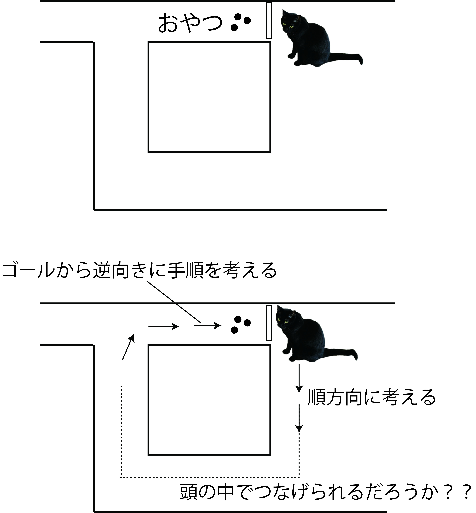
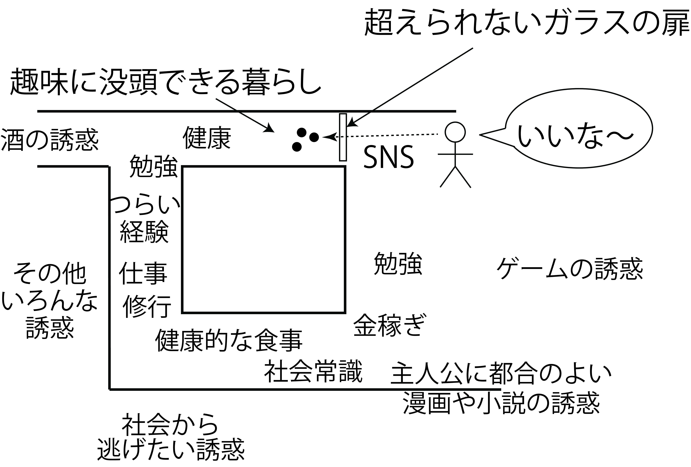
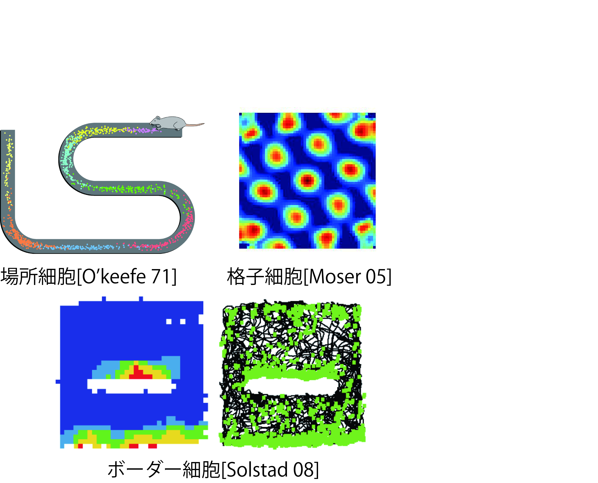

<!-- footer: 千葉工業大学・松本工業高校連携授業 -->

# 移動ロボット入門

千葉工業大学 上田 隆一

This work is licensed under a <a rel="license" href="http://creativecommons.org/licenses/by-sa/4.0/">Creative Commons Attribution-ShareAlike 4.0 International License</a>.

---

<!-- paginate: true -->

## 自己紹介

- 上田隆一という名前です
- ロボットの研究者です
- 長くなるので[続きはウェブで](https://ja.wikipedia.org/wiki/上田隆一)

---

## 宣伝: 本買って

- 左から順に
    - Linuxの本
    - ロボットの本（今日話する内容）
    - ロボットで使う数学の本

    

---

## 今日のテーマ

- 知能ってなんだろ？

---

## ある問題

- 登場人物（人物じゃないけど）
    - うちの猫様
    - 美味しいおやつ
    - 通路・扉
        - 扉は猫には開けられません
- 猫様はおやつまでたどり着けるだろうか？

---

## 答え: できない

- 扉の下に手を突っ込んでガリガリして諦める

<iframe width="560" height="315" src="https://www.youtube.com/embed/JmONWX1IWAk?si=kmL8VdtQict3X7Rn" title="YouTube video player" frameborder="0" allow="accelerometer; autoplay; clipboard-write; encrypted-media; gyroscope; picture-in-picture; web-share" referrerpolicy="strict-origin-when-cross-origin" allowfullscreen></iframe>

---

## ここで質問

- 人間なら簡単なのに猫には難しいのはなんで？
- 逆に言うと、おやつのところまで行くには何が必要？
    - 人間は何をしている？
    - 脳にどんな機能が必要？

---

## 答えあわせ

- 俯瞰ができていない（疑惑）
    - 猫の頭の中に地図はあるだろうか？
    - 自分の見ている風景が地図のどこに相当するか理解できてる？
- 計画ができていない（これは確実）
    - 頭の中でおやつの場所に行くまでの手順が思い浮んでなさそう

---

## 問題を難しくすると 人間にも難しい

- 複雑な迷路だと人間にも大変
- 迷路でなく人生だと？
    - 俯瞰できないから遊んでしまう
    - 俯瞰している親や先生の言うことを素直に聞かない
- 注意
    - 息抜きは大事・聞きすぎも問題
    - 親も先生も完全には俯瞰できてない

---

## 無駄話はこれまで

- 今の話をふまえると自分で考えるロボットをどう作ればよいでしょう？どうしたらロボットが自分で仕事ができるようになる？
    - 具体性もない（達成までの計画もない）のに「人を助けるロボットを作りたい」とか目を輝かせて夢みたいなことを無責任に言ってませんか？

いっしょに考えていきましょう

---

## ・・・といいつつ最後の無駄話

- 「地図」を頭に持っている動物がいる
    - 特定のところに行くと反応するようになる場所細胞
       - 自分の見ているものや動きの感覚（主観）を「場所」という客観的なものに変換
- 他，移動や環境の形状に反応する脳細胞が存在

出典: 場所細胞: Stuartlayton at English Wikipedia, CC BY-SA 3.0, via Wikimedia Commons, https://commons.wikimedia.org/wiki/File:Boundary_cell.png. 格子細胞: Khardcastle, CC BY-SA 4.0, via Wikimedia Commons, https://commons.wikimedia.org/wiki/File:Autocorrelation_image.jpg. ボーダー細胞: Tom Hartley, Colin Lever, Sarah Stewart, CC BY-SA, via Wikimedia Commons, https://commons.wikimedia.org/wiki/File:Boundary_cell.png

---

## 移動ロボットの話

- 本題です
- とりあえず次のような問題を考える
   - ロボットがどこかに置かれる
       - 右図のようなやつ
   - ゴールがどこかロボットに教えられる
   - ロボットが自分でゴールまで行く

---

## 移動ロボットのハードウェア

---

## 地図づくり

- まずロボットに地図を与える
    - ロボットが動いてセンシングしたものをずれないようにつなげていく

<iframe width="560" height="315" src="https://www.youtube.com/embed/b2kYQ11PUSI?si=3VsJxUuX92oP6DZT" title="YouTube video player" frameborder="0" allow="accelerometer; autoplay; clipboard-write; encrypted-media; gyroscope; picture-in-picture; web-share" referrerpolicy="strict-origin-when-cross-origin" allowfullscreen></iframe>

