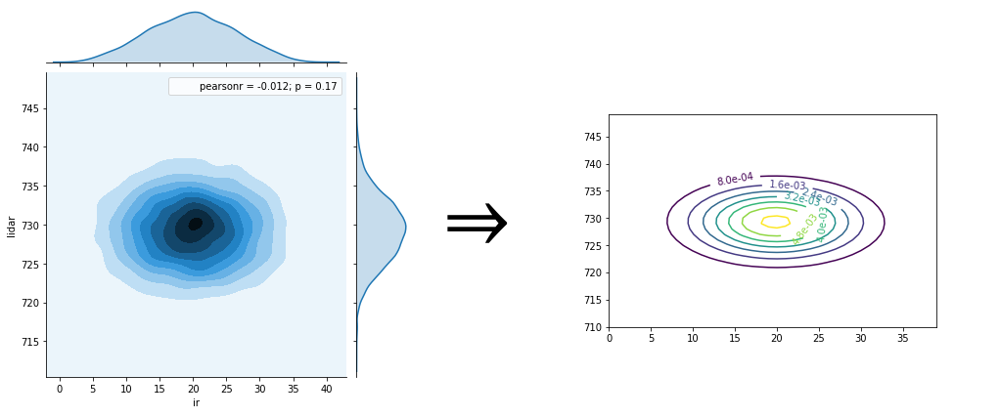
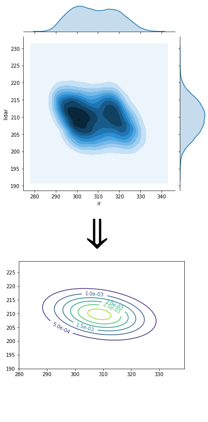

<!-- footer: 確率ロボティクス第3回 -->

# 確率ロボティクス第4回: 確率・統計の基礎III

千葉工業大学 上田 隆一

This work is licensed under a <a rel="license" href="http://creativecommons.org/licenses/by-sa/4.0/">Creative Commons Attribution-ShareAlike 4.0 International License</a>.

$$\newcommand{\V}[1]{\boldsymbol{#1}}$$
$$\newcommand{\jump}[1]{[\![#1]\!]}$$
$$\newcommand{\bigjump}[1]{\big[\!\!\big[#1\big]\!\!\big]}$$
$$\newcommand{\Bigjump}[1]{\bigg[\!\!\bigg[#1\bigg]\!\!\bigg]}$$

---

<!-- paginate: true -->

## ベイズの定理（詳解2.4.5項）

- 乗法定理: $p(z,t) = p(z|t)p(t) = p(t|z)p(z)$から導出
- 中辺、右辺から$p(z|t) = \dfrac{p(t|z)p(z)}{p(t)} = \eta p(t|z)p(z)$となる（ベイズの定理）
    - $\eta$: 正規化定数
        - $z$の確率の和（積分）が1になるように調整するための定数
    - 意味: $t$が分かると、$p(z)$が$p(z|t)$まで確かになる
        - センサ値の例: 得られた時間帯が分かれば、よりセンサ値の分布が確かに
        - $p(t|z)$が必要（これが何かはおいおい説明）

---

## ベイズの定理からの簡単な推定

- 例題
    - ある2種類のコインがあり、次のような性質があります。
        - コインAは表と裏が出る確率が半々
        - コインBは表と裏が出る確率がそれぞれ1/3、2/3
    - コインAとBを袋に入れて、1枚選択しました。（選ばれる確率は半々）
    - 選んだコインを2回投げたら「表、裏」と出ました。投げたのはどちらのコインでしょうか？

--- 

## 解答例

- 投げる前
    - $P(コインA) = P(コインB)=1/2$（以後「コイン」は省略）
- 最初の「表」が出たとき、ベイズの定理により
    $$P(A | 表) = P(表 | A)P(A)/P(表) = (1/2 \cdot 1/2) / (5/12) = 3/5$$
    - ここで$P(表) = P(表|A)P(A) + P(表|B)P(B) = 1/2\cdot 1/2 + 1/3\cdot 1/2 = 5/12$
        - 今までで分かってる$P(A)$と$P(B)$を使用して計算
        - 周辺化の逆の計算をしている
- よって、この段階で$P(A|表) = 3/5$、$P(B|表) = 1-3/5 = 2/5$
    - 「表」は省略して、$P(A) = 3/5$、$P(B) = 2/5$として次の「裏」の情報を反映しましょう（次ページ）

--- 

- 次の「裏」が出たとき
    - $P(A | 裏) = P(裏 | A)P(A)/P(裏)$
    $\qquad\qquad= P(裏 | A)P(A)/\{P(裏|A)P(A) + P(裏|B)P(B) \}$
    $\qquad\qquad= (1/2 \cdot 3/5) / (1/2 \cdot 3/5 + 2/3 \cdot 2/5) = 17/100$
    - $P(B | 裏) = 1 - 17/100 = 83/100$
- 答え: いまのところコインA、Bである確率はそれぞれ17%、83%
    - もっと投げるとだんだんどちらかの確率が100%に近づいていく
        - どちらかのコインを選び、表裏を乱数で得てベイズの定理を適用するとシミュレーション可能

--- 

## 多次元のガウス分布（詳解2.5節）

---

## 2次元のガウス分布の当てはめ（詳解2.5.1）

- 下の図: 700[mm], 12〜16時台の光センサとLiDARの値の分布
    - それぞれ$x,y$と表して$\V{z} = (x \ y)^T$を考える
        - $x,y$どちらの変数を周辺化してもガウス分布に当てはまりがよい

同時確率分布$P(\V{z})$はどんな数式で表現できるか？

---

### 多次元のガウス分布

- 次のような確率密度関数（$n$次元ガウス分布）を作ると、どの変数を残して周辺化してもガウス分布に
    - $\mathcal{N}(\boldsymbol{z} | \boldsymbol{\mu}, \Sigma) = - \frac{1}{\sqrt{(2\pi)^n|\Sigma|}} \exp \left\{ -\frac{1}{2}(\boldsymbol{z}-\boldsymbol{\mu})^T\Sigma^{-1}(\boldsymbol{z}-\boldsymbol{\mu})\right\}$$= \eta \exp \left\{-\frac{1}{2}(\boldsymbol{z}-\boldsymbol{\mu})^T\Sigma^{-1}(\boldsymbol{z}-\boldsymbol{\mu})\right\}$
        - $\boldsymbol{\mu}$: 中心（$n$次元）
        - $\Sigma$: 共分散行列（$n \times n$対称行列）
    - 形状: 前のスライドの分布のように、等高線を引くと楕円に

共分散行列って何？

---

### 共分散行列

- 2次元の場合、次のような行列
    - $\Sigma = \begin{pmatrix}\sigma_x^2 & \sigma_{xy} \\ \sigma_{xy} & \sigma_y^2\end{pmatrix}$
        - $\sigma_x^2, \sigma_y^2$: $x, y$の分散、$\sigma_{xy}$: 共分散　
- $\sigma_{xy} = \frac{1}{N}\sum_{i=0}^{N-1}(x_i-\mu_x)(y_i-\mu_y)$
    - なんなのかはあとで

イメージが難しいのでセンサ値から作って理解しましょう

---

### 2次元ガウス分布の当てはめ

- 光センサ、LiDARのセンサ値を2次元ガウス分布に
    - $\boldsymbol{\mu} = \frac{1}{N}\sum_{i=0}^{N-1} \boldsymbol{z}_i = (19.9 \ 729.3)^T$
    - $\Sigma = \begin{pmatrix}\sigma_x^2 & \sigma_{xy} \\ \sigma_{xy} & \sigma_y^2\end{pmatrix} = \begin{pmatrix}42.1 & -0.3 \\ -0.3 & 17.7\end{pmatrix}$

---

## 共分散の意味（詳解2.5.2項）

- 式（再掲）
    - $\sigma_{xy} = \frac{1}{N}\sum_{i=0}^{N-1}(x_i-\mu_x)(y_i-\mu_y) = \big\langle (x - \mu_x)(y - \mu_y) \big\rangle_{P(x,y)}$
        - $x_i -\mu_x$と$y_i -\mu_y$の符号の多くが一致していると正、不一致だと負に　
- 共分散が正、負になると楕円が傾く（図）
    - 左: $\sigma_{xy}=25\sqrt{3}$、右: $\sigma_{xy}=-25\sqrt{3}$
     （どちらも$\sigma_x^2 = 100, \sigma_y^2 = 50$）

 　　　　　 $x$が大きいと$y$が大きく/小さくなりやすいという傾向を示す

---

### 例

- 上: 距離200[mm]のときの光センサとLiDARの値
    - 光センサの値が大きいとLiDARの値が小さい傾向
        - （形が悪いので例としては良くない）
    - 共分散を計算すると$\sigma_{xy} = -13.4$（負の値）　
- 下: ガウス分布に（むりやり）当てはめて描画
    - 右下がりに傾く

---

## 共分散行列と誤差楕円（詳解2.5.3項）

- 共分散行列は対角行列を回転行列で挟んだ形になる
    - 左のガウス分布:
        $$\Sigma = \begin{pmatrix} 100 & 25\sqrt{3} \\ 25\sqrt{3} & 50 \end{pmatrix} =         R_{\pi/6} \begin{pmatrix} 125 & 0 \\ 0 & 25 \end{pmatrix} R_{\pi/6}^{-1}$$
    - 右のガウス分布:
        $$\Sigma = \begin{pmatrix} 100 & -25\sqrt{3} \\ -25\sqrt{3} & 50 \end{pmatrix} =         R_{-\pi/6} \begin{pmatrix} 125 & 0 \\ 0 & 25 \end{pmatrix} R_{-\pi/6}^{-1}$$
    - 等高線は楕円を回転させたもの
    - 長軸、短軸の長さ $\propto$ 固有値 （= その方向の標準偏差）

---

### 誤差楕円

- 長軸、短軸の長さが各軸の標準偏差の$\alpha$倍の楕円
    - $\alpha$を定数とすると楕円内の確率が一定値に
    $\Longrightarrow$大きさでガウス分布の不確かさが比較可能
    - 詳解確率ロボティクスの図では$\alpha=3$
        - 2次元の場合、内部の確率は$0.99$
            - ただし、自己位置推定の場合はバイアスなどの問題で少し外にロボットがいる場合が多い

---

## 変数の和に対するガウス分布の合成（詳解2.5.4）

- 次のような問題を考える
    - 変数$\V{x}_1, \V{x}_2$がそれぞれガウス分布にしたがう
    - このとき$\V{x}_3 = \V{x}_1 + \V{x}_2$の分布は？　
- このような問題がロボットで発生する例
    - ロボットが1[m]動くとき、行き先がガウス分布でばらつく
    - ロボットがもう1[m]動いたら最終的な分布はどうなるか？

計算しましょう

---

### 計算

- $\V{x}_1, \V{x}_2$の分布を考える
    - $\V{x}_1 \sim \mathcal{N}_1(\V{x} | \V{\mu_1},\Sigma_1)$
    - $\V{x}_2 \sim \mathcal{N}_2(\V{x} | \V{\mu_2},\Sigma_2)$　
- $\V{x}_3$の分布を次のように周辺化して求める
    - $p(\V{x}_3) = \langle p(\V{x}_3| \V{x}_1)p(\V{x}_1)\rangle_{\V{x}_1}$
    　　　（$\langle f \rangle_x$は詳解確率ロボティクスで$\jump{f}_x$と表記している$\int_{-\infty}^{\infty} f \text{d}x$の略記）
        - $p(\V{x}_1)$というのは$\mathcal{N}_1$のこと
        - $p(\V{x}_3 | \V{x}_1)$の値は$\mathcal{N}_2(\V{x}_3 - \V{x}_1 | \V{x}_1, \V{\mu}_2, \Sigma_2)$に等しい
            - $\because \V{x}_1$のときに$\V{x}_3$となるという事象は、$\V{x}_1$のときに$\V{x}_2 = \V{x}_3 - \V{x}_1$となる事象と同じ

$\V{p}(\V{x}_3)$の式に$\mathcal{N}_1, \mathcal{N}_2$を代入（次ページ）

---

### 計算（続き）

- $p(\V{x}_3) = \eta \left\langle e^{-\frac{1}{2} (\V{x}_3-\V{x}_1-\V{\mu}_2)^\top\Sigma_2^{-1}( \V{x}_3-\V{x}_1-\V{\mu}_2  )} e^{-\frac{1}{2} (\V{x}_1-\V{\mu}_1)^\top\Sigma_1^{-1}(\V{x}_1-\V{\mu}_1)}\right\rangle_{\V{x}_1}$
$= \eta \left\langle e^{-\frac{1}{2} (\V{x}_3-\V{x}_1-\V{\mu}_2)^\top\Sigma_2^{-1}( \V{x}_3-\V{x}_1-\V{\mu}_2  )-\frac{1}{2} (\V{x}_1-\V{\mu}_1)^\top\Sigma_1^{-1}(\V{x}_1-\V{\mu}_1)} \right\rangle_{\V{x}_1}$
$= \cdots$（詳解確率ロボティクスの付録B.1.9の方法で$\V{x}_1$の積分が除去できる）
$= \eta e^{-\frac{1}{2} (\V{x}_3-\V{\mu}_1-\V{\mu}_2)^\top(\Sigma_1 +\Sigma_2)^{-1}( \V{x}_3-\V{\mu}_1-\V{\mu}_2  )}$
$= \mathcal{N}(\V{x}_3 | \V{\mu}_1+\V{\mu}_2, \Sigma_1 + \Sigma_2)$　
- $\V{x}_3$の分布はガウス分布に
    - 分布の中心は$\V{\mu}_1$と$\V{\mu}_2$の和
    - 共分散行列も$\Sigma_1$と$\Sigma_2$の和

共分散行列の足し算で不確かさが計算できる

---

## 2.5.5 ガウス分布同士の積

- 2つの分布をかけて正規化し、新たな$\V{x}$の分布$p_3(\V{x})$を作ってみましょう
    - $p_1(\V{x}) = \mathcal{N}(\V{x} | \V{\mu}_1, \Sigma_1)$
    - $p_2(\V{x}) = \mathcal{N}(\V{x} | \V{\mu}_2, \Sigma_2)$

---

### 計算

- ガウス分布の積をつくる
    - $p_3(\V{x}) = \eta e^{ -\frac{1}{2} (\V{x} - \V{\mu}_1)^\top \Sigma_1^{-1} (\V{x} - \V{\mu}_1)} e^{ -\frac{1}{2} (\V{x} - \V{\mu}_2)^\top \Sigma_2^{-1} (\V{x} - \V{\mu}_2)}$
$= \eta e^{ -\frac{1}{2} (\V{x} - \V{\mu}_1)^\top \Sigma_1^{-1} (\V{x} - \V{\mu}_1) -\frac{1}{2} (\V{x} - \V{\mu}_2)^\top \Sigma_2^{-1} (\V{x} - \V{\mu}_2)}$　
- 指数部を整理すると次のようになる
    - $p_3(\V{x})= \eta e^{ -\frac{1}{2} (\V{x} - \V{\mu}_3)^\top \Sigma_3^{-1}(\V{x} - \V{\mu}_3)}$
       - $\Sigma_3 = (\Sigma_1^{-1} + \Sigma_2^{-1})^{-1}$
       - $\V{\mu}_3 = \Sigma_3(\Sigma_1^{-1} \V{\mu}_1 + \Sigma_2^{-1} \V{\mu}_2)$

ややこしいのでもう少し整理

---

### 精度行列による表現

- 精度行列$\Lambda$: 共分散行列$\Sigma$の逆行列
    - $\Lambda = \Sigma^{-1}$　
- 前ページの分布を精度行列で表現
    - $ p\_3(\V{x})= \eta e^{ -\frac{1}{2} (\V{x} - \V{\mu}\_3)^\top \Lambda\_3(\V{x} - \V{\mu}\_3)}$
       - $\Lambda_3 = \Lambda_1 + \Lambda_2$
       - $\V{\mu}_3  = \Lambda_3^{-1}(\Lambda_1 \V{\mu}_1 + \Lambda_2 \V{\mu}_2) = (\Lambda_1 + \Lambda_2)^{-1}(\Lambda_1 \V{\mu}_1 + \Lambda_2 \V{\mu}_2)$
           - 1次元の場合: $\mu_3 = \dfrac{\lambda_1^2}{\lambda_1^2 + \lambda_2^2}\mu_1 + \dfrac{\lambda_2^2}{\lambda_1^2 + \lambda_2^2}\mu_2$($\lambda^2_i = \sigma^{-2}_i$: 精度)

精度行列の和で不確かさの減少が計算できる
中心は重みつき平均に（精度のよい分布の側に寄る）

---

## 2.6 まとめ

- 2.4節までのまとめ: 前回、前々回のまとめの通り
- このスライド（2.5節）のまとめ
    - 多次元ガウス分布を扱った
    - 共分散行列は分布の大きさや向きを表す
    - ガウス分布にしたがう変数の和の分布、ガウス分布の積は再びガウス分布となる
        - 共分散行列（精度行列）、中心の計算は単純な足し算になる
        $\Longrightarrow$計算は複雑だがプログラムを書くと単純に

