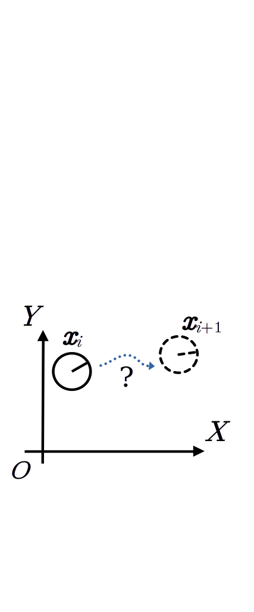
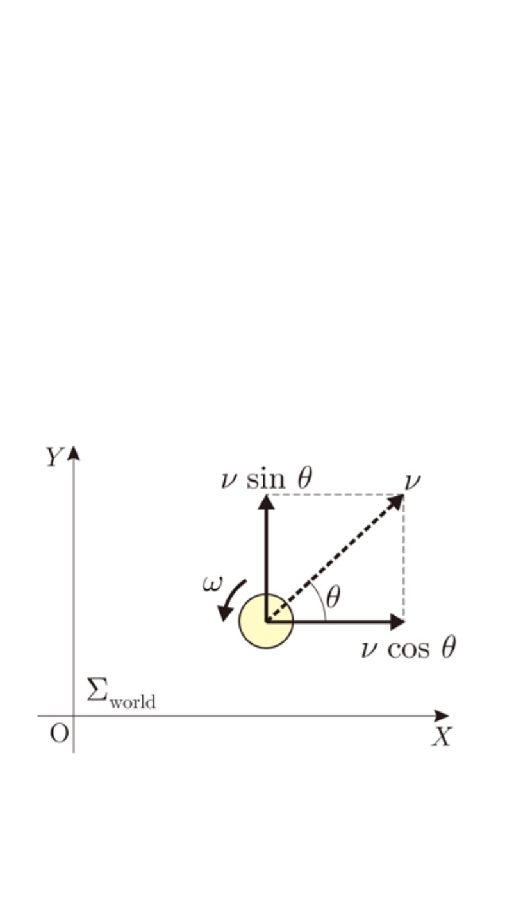

<!-- footer: 確率ロボティクス第5回 -->

# 確率ロボティクス第5回: 自律ロボットのモデル化

千葉工業大学 上田 隆一

This work is licensed under a <a rel="license" href="http://creativecommons.org/licenses/by-sa/4.0/">Creative Commons Attribution-ShareAlike 4.0 International License</a>.

図の一部は詳解確率ロボティクスから転載しています。

$$\newcommand{\V}[1]{\boldsymbol{#1}}$$
$$\newcommand{\jump}[1]{[\![#1]\!]}$$
$$\newcommand{\bigjump}[1]{\big[\!\!\big[#1\big]\!\!\big]}$$
$$\newcommand{\Bigjump}[1]{\bigg[\!\!\bigg[#1\bigg]\!\!\bigg]}$$

---

<!-- paginate: true -->

### 練習問題

- [独立した変数の和の分散](https://b.ueda.tech/?page=robot_and_stats_questions#独立した変数の和の分散)
- [2つのサイコロの目の分散](https://b.ueda.tech/?page=robot_and_stats_questions#2つのサイコロの目の分散)

---

### 今回の内容

- 講義で想定するロボットの動きを定義、計算
    - 雑音は考慮しない　
- ロボットの系を定式化する
    - 状態方程式
    - 観測方程式

---

## 想定するロボット（詳解3.1節）

- 対向2輪型ロボット
    - 車軸の両側に駆動輪がついており、軸の中心まわりに （つまりその場で）旋回可能
    - 本書では平面上を動くことを仮定
        - 実際にはスロープを登り降りできるが、扱わない

<iframe width="300" height="280" src="https://www.youtube.com/embed/zm0gP6o09lM" frameborder="0" allow="accelerometer; autoplay; encrypted-media; gyroscope; picture-in-picture" allowfullscreen></iframe>

---

### 対向2輪ロボットの動き

- 速度と角速度だけで表現できると仮定
    - トルクや加速度は無視
        
        - 図は詳解確率ロボティクスから転載

---

## 世界座標系と描画（詳解3.2.1, 3.2.2項）

- ロボットの動き回る平面を準備
    - 図のように$X$軸、$Y$軸を設置
    - 世界座標系$\Sigma_\text{world}$と名付ける
- ロボットが$\Sigma_\text{world}$でどのように存在しているか
    - $(x \ y)^\top$: 位置、$\theta$: 向きで表せる
    - ベクトル $\V{x} = (x \ y \ \theta)^\top$として表現
    - $\V{x}$: 「姿勢」と呼んだり「状態」と呼んだり
        - 姿勢: ロボット工学の用語
        - 状態: 制御工学の用語

---

### 状態と状態空間

制御の話をするために用語を整理

- ロボットのとりうる状態$\V{x}$の集合を$\mathcal{X}$とする
    - $\mathcal{X}$を状態空間と呼ぶ
    - 要はロボットが行ける範囲　
- 数式での表現
    - $\mathcal{X} = \{ \V{x} = (x \ y \ \theta)^\top | x \in [x_\text{min},x_\text{max}] ,y \in [y_\text{min},y_\text{max}], \theta \in [-\pi, \pi) \}$
    - $\V{x} \in \mathcal{X}$

注意（重要）: 簡単なうちに集合の表現をおさえておきましょう

---

## 時刻の扱い

- 時刻を離散的に表現
    - 1ステップの時間を$\Delta t$とする
        - 画像の更新周期33ms（ゆっくり動く移動ロボットなど）
        - 1ms（ダイナミクスまで考えるロボット）
    - $\Delta t$ごとに、時刻に$t=0,1,2,\dots$と番号を付与　
- 以後は離散時間でロボットの動きを考える
    - 理由: コンピュータで制御すると一定周期ごとに制御指令を出すことに

---

## ロボットの運動と状態方程式（詳解3.2.4項）

- 扱う問題: ある時刻にロボットが動いたとき、 次のステップにロボットの姿勢がどうなるか
    - $\V{x}_i$: 時刻が$t=i$のときの状態

---

### 制御指令

- ロボットに与える速度、角速度をそれぞれ $\nu$[m/s]、$\omega$[rad/s]と表現
    - まとめて$\V{u} = (\nu \ \omega)^\top$と表現
    - 制御指令と呼ぶ
        - 制御入力などとも呼ぶが、入力か出力か紛らわしいので

制御指令と状態の関係は？？

---

### 世界座標系におけるロボットの動き

- こうなる
    - $\dot{x} = \nu \cos \theta$　　　　
    - $\dot{y} = \nu \sin \theta$
    - $\dot{\theta} = \omega$　　　
        - ここで$\dot{a} = \dfrac{\text{d}a}{\text{d}t}$

- 問題： 時刻$t-1$から$t$の間に制御指令$\V{u}_t$で 姿勢は$\V{x}_{t-1}$からどう変わるか（計算できます？）

---

### 姿勢の変化の計算

- 向き$\theta$の変化は単純
    - $\theta_{t} = \theta_{t-1} + \int_{0}^{\Delta t} \omega_t dt  = \theta_{t-1} + \omega_t \Delta t$　
- 位置の変化の計算では時間$\Delta t$内での向きの変化を考慮しなければならない
    - $\begin{pmatrix} x_t \\ y_t \end{pmatrix} = \begin{pmatrix} x_{t-1} \\ y_{t-1} \end{pmatrix} + \begin{pmatrix} \int_0^{\Delta t} \nu_t \cos ( \theta_{t-1} + \omega_t t ) dt\\ \int_0^{\Delta t} \nu_t \sin ( \theta_{t-1} + \omega_t t ) dt \end{pmatrix}$
$= \cdots$
$= \begin{pmatrix} x\_{t-1}  \\ y\_{t-1} \end{pmatrix} + \nu\_t\omega\_t^{-1} \begin{pmatrix} \sin( \theta\_{t-1} + \omega\_t \Delta t ) - \sin\theta\_{t-1} \\ -\cos( \theta\_{t-1} + \omega\_t \Delta t ) + \cos\theta\_{t-1} \end{pmatrix}$
         - $\omega_t = 0$の場合は別の式になるが極限をとると一致

---

### 状態方程式

- 前ページの計算結果のまとめ
    - $\begin{pmatrix} x_t \\ y_t \\ \theta_t \end{pmatrix} = \begin{pmatrix} x_{t-1}  \\ y_{t-1} \\ \theta_{t-1} \end{pmatrix} + \nu_t\omega_t^{-1} \begin{pmatrix} \sin( \theta_{t-1} + \omega_t \Delta t ) - \sin\theta_{t-1} \\ -\cos( \theta_{t-1} + \omega_t \Delta t ) + \cos\theta_{t-1} \\ \omega_t \Delta t\end{pmatrix}$　
- 面倒なので次のように書く
    - $\V{x}_t = \V{f}(\V{x}_{t-1},\V{u}_t) \qquad (t=1,2,3,\dots)$
        - ロボットの動きはこれだけで表される（雑音がなければ）　
- 用語
    - 上の方程式: 状態方程式
    - 関数$\V{f}$: 状態遷移関数
    - 状態が$\V{x}_{t-1}$から$\V{x}_t$に変わること: 状態遷移

---

### 状態方程式で作ったロボットの動き

 

---

## ロボットの観測（詳解3.3節）

- ロボットにセンサを搭載
    - カメラで何かの位置を計測するというモデル
        - LiDARなどの登場で古典的になってしまったが数式の理解には一番良い （・・・と2023年まで書いていたけどまた復活の機運）

---

## 3.3.1 点ランドマークの設置

- 点ランドマーク
    - カメラで観測すると、方角と距離が計測できるもの
    - 下図: 点ランドマークとみなせる物体の例

 

---

## シミュレータ中のランドマーク

- 環境中に$N_\textbf{m}$個置く　
- 記号の定義
    - 一つ一つにIDを付与し、$\text{m}_0, \text{m}_1, \text{m}_2, \dots$と表す
        - 座標は$\V{m}_j = (m_{j,x} \ m_{j,y})^T$
            - 普通の字体とイタリック体を使い分けるので注意
    - ランドマークの集合を地図と呼ぶ 
        - 地図: $\textbf{m} = \{ \text{m}_j | j = 0,1,2,\dots, N_\textbf{m} -1 \}$

 

---

## 3.3.2 点ランドマークの観測

- シミュレータの設定
    - センサから見て距離$\ell$と方角$\varphi$が計測可能
        - これらの値をセンサ値 $\V{z} = (\ell \ \varphi)^T$と呼ぶ
        - センサ座標系とロボット座標系は同じとする　
- ランドマークの位置とセンサ値の関係
    - $\ell_j = |\V{m}_j - \V{x}| = \sqrt{(m_{j,x} - x)^2 + (m_{j,y} - y)^2}$
    - $\varphi_j = \text{atan2}(m_{j,y} - y, m_{j,x} - x) - \theta$

 

---

### 観測方程式

- 前ページの計算結果のまとめ
    - $\begin{pmatrix} \ell_j \\  \varphi_j \end{pmatrix} = \begin{pmatrix} \sqrt{(m_{j,x} - x)^2 + (m_{j,y} - y)^2} \\ \text{atan2}(m_{j,y} - y, m_{j,x} - x) - \theta\end{pmatrix}$　
- 面倒なので次のように書く
    - $\V{z}_j = \V{h}_j (\V{x})$
    - $\V{z}_j = \V{h}(\V{x}, \V{m}_j)$（ランドマークの位置を変数とする場合）
    - ロボットの観測はこれだけで表される（雑音がなければ）　
- 用語
    - 上の方程式: 観測方程式
    - 関数$\V{h}_j$: 観測関数

---

### 観測方程式で作ったロボットの観測

- 左: ロボットの姿勢とランドマークの位置からセンサ値を描画
- 右: 計測可能な範囲に制限を加えたもの
    - 距離計測: $0.5$〜$6$[m]
    - 方角計測: $-60$〜$60$[deg]

　　
 

---

## 3.4 コードの保存と再利用

作業なので省略

---

## 3.5 まとめ

- 本章で実装した制御系
    - 次の2つの式が全て
        - 状態方程式: $\V{x}_t = \V{f}(\V{x}_{t-1},\V{u}_t)$
        - 観測方程式: $\V{z}_{j,t} = \V{h}_j(\V{x}_t)$　
    - 非線形時不変離散時間系
        - 非線系: 行列の積と和で表現不可能
        - 時不変系: 時間で状態方程式や観測方程式が変わらない
        - 離散時間系: 時刻が離散的　
- 残った作業
    - 系に不確かさがない
