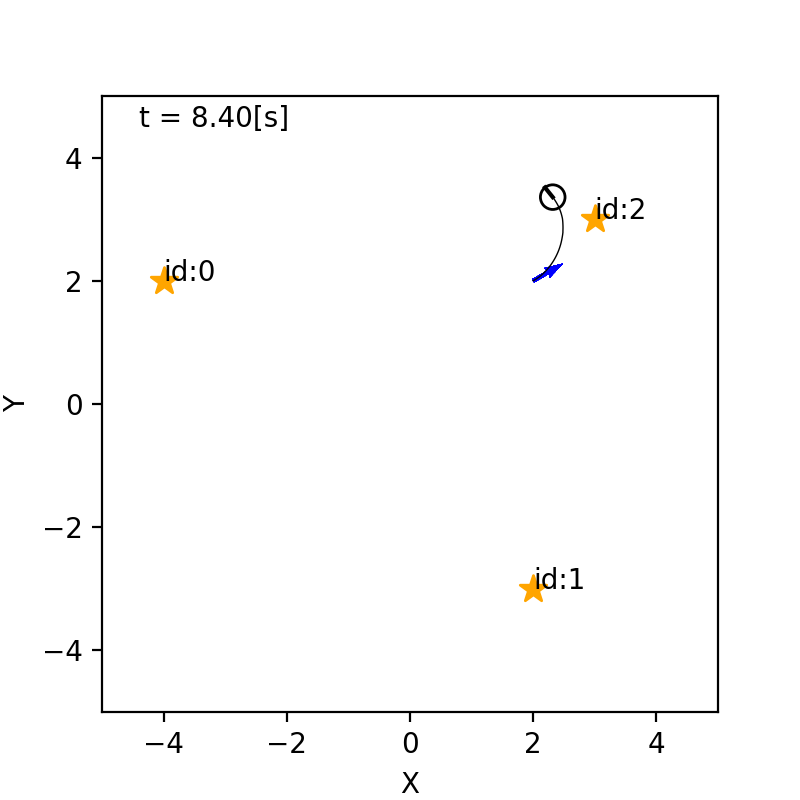

<!-- footer: 確率ロボティクス第8回 -->

# 確率ロボティクス第8回: パーティクルフィルタによる自己位置推定

千葉工業大学 上田 隆一

This work is licensed under a <a rel="license" href="http://creativecommons.org/licenses/by-sa/4.0/">Creative Commons Attribution-ShareAlike 4.0 International License</a>.

図の一部は詳解確率ロボティクスから転載しています。

$$\newcommand{\V}[1]{\boldsymbol{#1}}$$
$$\newcommand{\jump}[1]{[\![#1]\!]}$$
$$\newcommand{\bigjump}[1]{\big[\!\!\big[#1\big]\!\!\big]}$$
$$\newcommand{\Bigjump}[1]{\bigg[\!\!\bigg[#1\bigg]\!\!\bigg]}$$

---

<!-- paginate: true -->

## 前回のおさらいと今回の内容

- ベイズフィルタ
    - 次の2つの式で構成
        - 移動時: $\hat{b}_t(\V{x}) =  \big\langle p(\V{x} | \V{x}', \V{u}_t) \big\rangle_{b_{t-1}(\V{x}')}$ 
        - 観測時: $b_t(\V{x}) = \eta p(\textbf{z}_t | \V{x}) \hat{b}_t(\V{x})$
    - 問題: 式をどうやって実装する？
- 今回: パーティクルフィルタというものを使いましょう

---

## パーティクルによる近似（詳解5.2節）

- 信念分布をパーティクル（の集合）で表現
    - パーティクル: ロボットの分身
    - 分身をシミュレート$\Rightarrow$分身の分布が信念分布　
- 数式でのパーティクルの表現
    - $\V{x}_t^{(i)}$$\quad(i=0,1,2,\dots,N-1)$
        - 注意: あとから変えます
        - 分身なので姿勢を変数に持つ
        - $N$個ある　
- 右図の青の矢印
    - ロボットの初期姿勢に置いた 100個のパーティクル（まだ動かない）

---

## 移動後のパーティクルの姿勢更新（詳解5.3節）

- やること: ロボットの動きをシミュレートしてパーティクルを動かす
    - センサについてはまだ扱わない
    - 雑音とバイアスのシミュレーション
    - パーティクルの分布が信念分布　
- 前回のような雑音のモデルが使えるが、パラメータが分からない
    - ロボットの動きの統計をとって求める
    - 環境が変わるとパラメータも変わるので、勘で設定してもよい
        - 最終的に推定できれば良いパラメータ

---

## パーティクルの移動のための状態遷移モデルの例（詳解5.3.1節）

- 移動にともなう姿勢のばらつきをガウス分布で表現
    - 前回と違うけどなんとなく
        - 様々な誤差を考慮していると最終的にはガウス分布に（中心極限定理）　
        - （注意: パーティクルフィルタでは必ずしもガウス分布を使わなくてもよく、むしろセンシングでガウス分布を使いたくないから考えられている）
- ガウス分布を4つの標準偏差で表現
    - $\sigma_{\nu\nu}$: 直進1[m]で生じる道のりのばらつき
    - $\sigma_{\nu\omega}$: 回転1[rad]で生じる道のりのばらつき
    - $\sigma_{\omega\nu}$: 直進1[m]で生じるロボットの向きのばらつき
    - $\sigma_{\omega\omega}$: 回転1[rad]で生じるロボットの向きのばらつき　

これらの値を実験で求めて（あるいは勘で設定して）パーティクルの挙動に反映

---

## 位置や角度の雑音を速度、角速度の雑音に変換

- $\sigma_{\nu\nu}$のとき、$\nu$に乗せる雑音の量の決め方
    1. $\delta_{\nu\nu} \sim \mathcal{N}(0, \sigma_{\nu\nu}^2)$
        - $\delta_{\nu\nu}$: 1[m]あたりの誤差
    2.  $\delta_{\nu\nu}' = \delta_{\nu\nu}\sqrt{|\nu|/\Delta t}$
        - $\delta_{\nu\nu}'$: 速度に乗せる誤差
        - 分散（誤差の2乗）の大きさは移動距離に比例するので
$\delta_{\nu\nu}^2 : (\delta'_{\nu\nu}\Delta t)^2 = 1 : |\nu|\Delta t$
    3. $\sigma_{\nu\omega}, \sigma_{\omega\nu}, \sigma_{\omega\omega}$についても同様に
    4. $\begin{pmatrix} \nu' \\ \omega' \end{pmatrix} = \begin{pmatrix} \nu \\ \omega \end{pmatrix} + \begin{pmatrix} \delta_{\nu\nu}\sqrt{|\nu|/\Delta t} + \delta_{\nu\omega}\sqrt{|\omega|/\Delta t} \\ \delta_{\omega\nu}\sqrt{|\nu|/\Delta t} + \delta_{\omega\omega}\sqrt{|\omega|/\Delta t} \end{pmatrix}$
        - $(\nu \ \omega)^\top$: 制御指令
        - $(\nu' \ \omega')^\top$: 実際の速度

---

## 状態遷移モデルの実装（詳解5.3.2項）

- 前ページの式を実装してパーティクルを動かす
    - （念のため）パーティクルごとに雑音の量は変える
- まだ$\sigma_{\nu\nu}, \sigma_{\nu\omega}, \sigma_{\omega\nu}, \sigma_{\omega\omega}$の値は未定なので適当な値で観察
    - 左図: シミュレータのロボットの30[s]後の姿勢のばらつき
    - 中図: 値を小さくしたとき（小さすぎる）
    - 右図: 値を大きくしたとき（大きすぎる）

---

## パラメータの調整（詳解5.3.3項）

- ここは割愛
- パーティクルフィルタを理解してから詳解確率ロボティクスを読み返してみてください
    - 注意: 詳解確率ロボティクスに書いてある実験方法は理屈の説明のためにかなり厳密になっており、実機でやるには時間がかかりすぎるので、実際のロボットの動きを見ながら勘で調整してもよい

---

## 求めたパラメータによる動作確認（詳解5.3.4）

- 左: 30[s]後のロボットの姿勢のばらつき
- 右: 求めた4つの標準偏差で30[s]パーティクルを動作
    - ロボットの左右で分布が少し広いがシミュレートできている
&nbsp;

---

### パーティクルによる近似の数式上の解釈

- パーティクルの分布は信念分布の近似
- 次のような確率計算が可能
    - $P(\V{x}_t^* \in X ) = \int_{\V{x} \in X} \hat{b}_t(\V{x}) d\V{x} \approx \dfrac{1}{N} \sum_{i=0}^{N-1} \delta(\V{x}_t^{(i)} \in X)$
        - $X \subset \mathcal{X}$（状態空間$\mathcal{X}$の部分空間）
        - $\delta($事象$)$: 事象が正しければ1、違えば0を返す関数　
    - 式で書くとややこしいが、「ある領域$X$内にロボットの姿勢が含まれる確率は、その領域内にどれだけの割合のパーティクルが含まれるかで近似計算できる」ということ

---

### ベイズフィルタとの関係

- ベイズフィルタの移動時の式: $\hat{b}_t(\V{x}) =  \big\langle p(\V{x} | \V{x}', \V{u}_t) \big\rangle_{b_{t-1}(\V{x}')}$　
- パーティクルフィルタとベイズフィルタの対応
    - 移動前のパーティクル: $\V{x}^{(i)}_{t-1} \sim b_{t-1}$
    - 移動後のパーティクル: $\V{x}^{(i)}_t \sim p(\V{x} | \V{x}^{(i)}_{t-1}, \V{u}_t)$

期待値計算をサンプリングで実装

---

## まとめ

- 以下を確認
    - パーティクルによる信念分布の近似方法
    - ロボットが動いたときのパーティクルの位置の更新方法
