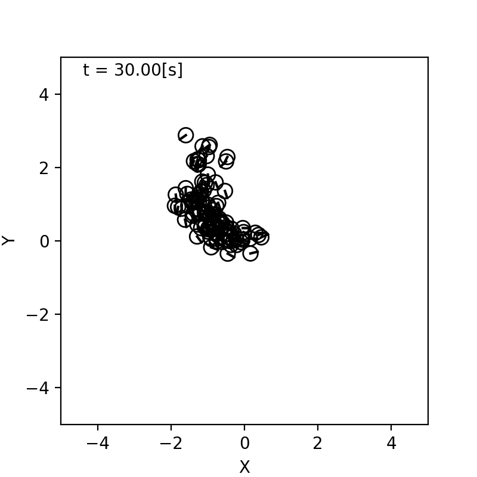

<!-- footer: 確率ロボティクス第8回 -->

# 確率ロボティクス第8回: パーティクルフィルタによる自己位置推定

千葉工業大学 上田 隆一

This work is licensed under a <a rel="license" href="http://creativecommons.org/licenses/by-sa/4.0/">Creative Commons Attribution-ShareAlike 4.0 International License</a>.

図の一部は詳解確率ロボティクスから転載しています。

$$\newcommand{\V}[1]{\boldsymbol{#1}}$$
$$\newcommand{\jump}[1]{[\![#1]\!]}$$
$$\newcommand{\bigjump}[1]{\big[\!\!\big[#1\big]\!\!\big]}$$
$$\newcommand{\Bigjump}[1]{\bigg[\!\!\bigg[#1\bigg]\!\!\bigg]}$$

---

<!-- paginate: true -->

## 前回のおさらいと今回の内容

- ベイズフィルタ
    - 次の2つの式で構成
        - 移動時: $\hat{b}_t(\V{x}) =  \big\langle p(\V{x} | \V{x}', \V{u}_t) \big\rangle_{b_{t-1}(\V{x}')}$ 
        - 観測時: $b_t(\V{x}) = \eta p(\textbf{z}_t | \V{x}) \hat{b}_t(\V{x})$
    - 問題: 式をどうやって実装する？
- 今回: パーティクルフィルタというものを使いましょう

---

## パーティクルによる近似（詳解5.2節）

- 信念分布をパーティクル（の集合）で表現
    - パーティクル: ロボットの分身
    - 分身をシミュレート$\Rightarrow$分身の分布が信念分布　
- 数式でのパーティクルの表現
    - $\V{x}_t^{(i)}$$\quad(i=0,1,2,\dots,N-1)$
        - 注意: あとから変えます
        - 分身なので姿勢を変数に持つ
        - $N$個ある　
- 右図の青の矢印
    - ロボットの初期姿勢に置いた 100個のパーティクル（まだ動かない）

---

## 移動後のパーティクルの姿勢更新（詳解5.3節）

- やること: ロボットの動きをシミュレートしてパーティクルを動かす
    - 実際のロボットの動きのばらつきを忠実に再現するのが理想的
        - パーティクルの分布が真の分布にしたがう
- ただし・・・
    - どんな誤差要因があるか、その量がどれだけかは特定が難しい
    - 次の日に変わるかもしれないし、1m先でも変わるかもしれない
- 環境が変わるとパラメータも変わるので、勘で設定してもよい
    - 最終的に推定できれば良いパラメータ
    - すこしばらつきを大きくとっておくとセンサで修正可能

---

## パーティクルの移動のための状態遷移モデルの例（詳解5.3.1節）

- 移動にともなう姿勢のばらつきをガウス分布で表現
    - 様々な誤差を考慮していると最終的にはガウス分布に（中心極限定理）　
    - （注意: パーティクルフィルタでは必ずしもガウス分布を使わなくてもよく、むしろセンシングでガウス分布を使いたくないから考えられている）
- ガウス分布を4つの標準偏差で表現
    - $\sigma_{\nu\nu}$: 直進1[m]で生じる道のりのばらつき
    - $\sigma_{\nu\omega}$: 回転1[rad]で生じる道のりのばらつき
    - $\sigma_{\omega\nu}$: 直進1[m]で生じるロボットの向きのばらつき
    - $\sigma_{\omega\omega}$: 回転1[rad]で生じるロボットの向きのばらつき　

これらの値を実験で求めて（あるいは勘で設定して）パーティクルの挙動に反映

---

## 位置や角度の雑音から速度、角速度の雑音への変換

- $\sigma_{\nu\nu}$のとき、$\nu$に乗せる雑音の量の決め方
    1. $\delta_{\nu\nu} \sim \mathcal{N}(0, \sigma_{\nu\nu}^2)$
        - $\delta_{\nu\nu}$: 1[m]あたりの誤差
    2.  $\delta_{\nu\nu}' = \delta_{\nu\nu}\sqrt{|\nu|/\Delta t}$
        - $\delta_{\nu\nu}'$: 速度に乗せる誤差
        - 分散（誤差の2乗）の大きさは移動距離に比例するので
$\delta_{\nu\nu}^2 : (\delta'_{\nu\nu}\Delta t)^2 = 1 : |\nu|\Delta t$
    3. $\sigma_{\nu\omega}, \sigma_{\omega\nu}, \sigma_{\omega\omega}$についても同様に
    4. $\begin{pmatrix} \nu' \\ \omega' \end{pmatrix} = \begin{pmatrix} \nu \\ \omega \end{pmatrix} + \begin{pmatrix} \delta_{\nu\nu}\sqrt{|\nu|/\Delta t} + \delta_{\nu\omega}\sqrt{|\omega|/\Delta t} \\ \delta_{\omega\nu}\sqrt{|\nu|/\Delta t} + \delta_{\omega\omega}\sqrt{|\omega|/\Delta t} \end{pmatrix}$
        - $(\nu \ \omega)^\top$: 制御指令
        - $(\nu' \ \omega')^\top$: 実際の速度

---

## 状態遷移モデルの実装（詳解5.3.2項）

- 前ページの式を実装して値を設定し、パーティクルを動かす
    - 右図: シミュレータのロボットの30[s]後の姿勢のばらつき
    - 下図: 右図のロボットに対するパラメータ設定の例
        - パラメータが小さすぎる/大きすぎる/ちょうど
- 値の設定方法は詳解確率ロボティクスの5.3.3項に

---

### パーティクルによる近似の数式上の解釈

- パーティクルの分布は信念分布の近似
- 次のような確率計算が可能
    - $P(\V{x}_t^* \in X ) = \int_{\V{x} \in X} \hat{b}_t(\V{x}) d\V{x} \approx \dfrac{1}{N} \sum_{i=0}^{N-1} \delta(\V{x}_t^{(i)} \in X)$
        - $X \subset \mathcal{X}$（状態空間$\mathcal{X}$の部分空間）
        - $\delta($事象$)$: 事象が正しければ1、違えば0を返す関数　
    - 式で書くとややこしいが、「ある領域$X$内にロボットの姿勢が含まれる確率は、その領域内にどれだけの割合のパーティクルが含まれるかで近似計算できる」ということ

---

### ベイズフィルタとの関係

- ベイズフィルタの移動時の式: $\hat{b}_t(\V{x}) =  \big\langle p(\V{x} | \V{x}', \V{u}_t) \big\rangle_{b_{t-1}(\V{x}')}$　
- パーティクルフィルタとベイズフィルタの対応
    - 移動前のパーティクル: $\V{x}^{(i)}_{t-1} \sim b_{t-1}$
    - 移動後のパーティクル: $\V{x}^{(i)}_t \sim p(\V{x} | \V{x}^{(i)}_{t-1}, \V{u}_t)$

期待値計算をサンプリングで実装

---

## 観測後のセンサ値の反映（詳解5.4節）

- やること: センサ値の持つ情報をパーティクルの分布に反映する
    - ベイズの定理を利用

---

## 5.4.2 センサ値によるパーティクルの姿勢の評価

- センサ値$\V{z}_j$が得られたときに、ふたつのパーティクル$\V{x}^{(i)}, \V{x}^{(k)}$のどっちがどれだけ真値としてふさわしい？　
- 観測分布の値$p_j (\V{z}_j | \V{x})$の比で数値化可能
    - 例: $p_j (\V{z}_j | \V{x}^{(i)}) = 0.02, p_j (\V{z}_j | \V{x}^{(k)}) = 0.01$
    $\rightarrow \V{x}^{(i)}$の方が$\V{x}^{(k)}$より2倍尤もらしい
    - $0.02$や$0.01$は確率ではないが確率的な比較は可能
    - 比: 尤度比、数値: 尤度　
- 観測モデル$p_j (\V{z}_j | \V{x})$は状態遷移モデルのときと同様、実験などで特定（後述）

---

### 尤度関数

- $p_j (\V{z}_j | \V{x})$について$\V{x}$を変数とみなす$\Longrightarrow$尤度関数
    - $L_j(\V{x} | \V{z}_j ) = \eta p_j (\V{z}_j | \V{x})$
        - $\eta$は正ならなんでもよい（比でしか利用しないので）
        - 条件（パラメータ）と変数が入れ替わっただけで同じ式　
- ベイズの定理との関係
    - あえて尤度を使って考察したが、今の議論はベイズの定理でも説明可能
    - $b_t(\V{x}_t^{(i)}) = \hat{b}_t(\V{x}_t^{(i)} | \V{z}_{j,t}) = \eta p_j(\V{z}_{j,t} | \V{x}_t^{(i)}) \hat{b}_t(\V{x}_t^{(i)}) \\\\ = \eta L_j (\V{x}_t^{(i)} | \V{z}_{j,t} ) \hat{b}_t(\V{x}_t^{(i)})$

---

## パーティクルの重み（詳解5.4.3項）

- 尤度をどうパーティクルの分布に反映するか？
    - とりあえず重みという変数を付加
- パーティクル（再定義）: $\xi_t^{(i)} = (\V{x}_t^{(i)}, w_t^{(i)})$
    - $\sum_{i=0}^{N-1} w^{(i)} = 1$　
- 次のように信念分布を近似
    - $P(\V{x}_t^* \in X ) = \int_{\V{x} \in X} b_t(\V{x}) d\V{x} \approx \sum_{i=0}^{N-1} w_t^{(i)} \delta(\V{x}_t^{(i)} \in X)$
        - $X$に真の姿勢が含まれる確率をパーティクルの重みの和で近似　
- 重みの計算
    - $w_t^{(i)} = L_j (\V{x}_t^{(i)} | \V{z}_{j,t} ) \hat{w}_t^{(i)}$（あとから正規化）

---

## 尤度関数の決定（紹介5.4.4項）

- 尤度関数（観測モデル）をどう決めるか
    - シミュレータの実装を見ると分かるが実際のセンサはブラックボックス
    - 状態遷移モデル同様、実験で

---

### 尤度関数の設計

- 次のような尤度関数を準備
    - $L_j(\V{x} | \V{z}_j) = \mathcal{N}\left[ \V{z} = \V{z}_j | \V{h}_j(\V{x}), Q_j(\V{x}) \right]$
        - $Q_j(\V{x}) = \begin{pmatrix} [\ell_j(\V{x})\sigma_\ell]^2 & 0 \\\\ 0 & \sigma^2_\varphi \end{pmatrix}$
        - $\ell_j(\V{x})$: $\V{x}$とランドマーク$\text{m}_j$の距離
        - $\V{h}_j$: 観測関数　
- 補足
    - 実はシミュレータと同じモデル
        - 本当はセンサ値の統計をとってから決めるべき

---

### センサ値の統計

- 書籍での実験
    - 1000個バイアスが異なるカメラを準備
    - 1[m]先の正面にあるランドマークを1回ずつ観測　
    - 実験の結果、$\sigma_\ell= 0.14$[m/m]、$\sigma_\varphi = 0.05$[rad]に

以後この値を使用するが、これでいいのか？

---

### 実験で統計をとることに関する議論

- 実験で「正しい」状態遷移・観測モデルは得られる？
    - モデルの妥当性の検証や統計の信頼性を上げるためには、もっと条件や実験回数を増やすことが必要
    - 一方、せっかくたくさん実験しても別環境でロボットが動かないことが多い
        - バイアスを考慮しないと顕著に
        - これなら実験結果を無視して分布を広くとったほうがマシ

実験で得られるモデルは、実験条件の枠内限定。自律ロボットは枠を超えることを期待される。そこが難しい。（人間も然り）

---

### ロボットを動かすときのアドバイス

注意: 私見です

- 実験で統計をとらずにモデルを決めてよい
    - 参考になるもの
        - カタログスペック
        - 勘（人間の知識を確率モデルとしてロボットに与える）
        - ロボットの挙動（ちょっと邪魔してもタスクがこなせるかどうか）　
- ロボットが動けばそれでよい
   - 動くものは結果で評価
   - 机上の空論よりまずは動かす。人間も然り（危険な場合は除く）
   - ロボティクスが他の学問と一番違う点のような気がします。

---

## 5.4.5 尤度関数の実装

- 作業については書籍を参考に
    - 下図: 重みを矢印の長さで表現したときのパーティクルの挙動
- 問題
    - 正規化していないので重みの和が無限大 or 0に
    - 正規化したとしても重みが一つのパーティクルに偏る

---

## 5.5 リサンプリング

- 重みの偏りの解決
- やること
    - 重みの大きいパーティクルを複数に分割
    - 一方で、パーティクルの数を一定に保つ　
- 「リサンプリング」という方法で実装
    - サンプリング: アンケートなどをとるときに母集団から標本を選ぶこと
    - リサンプリング: サンプリングされた標本から、標本を使ってもう一度サンプリング
（ややこしいので具体例で説明）

---

## 5.5.1 単純なリサンプリングの実装

- 次のようなリサンプリングのアルゴリズムを考える
    1. パーティクルから一つパーティクルを選ぶ
        - 選ばれる確率 $\propto $重み
    2. 選んだパーティクルのコピーを作成
        - コピーの重みは$1/N$に
    3. 1, 2を$N$回反復。$N$個のコピーを新たなパーティクルの集合に

---

### リサンプリングの効果

- 重みの小さいパーティクル$\Longrightarrow$選ばれにくく消失
- 重みの大きいパーティクル$\Longrightarrow$何度も選ばれる
    - 重みは発散せずに抑えられる　
- 効果
    - 重みが偏らず推定が安定
    - 高確率の領域にパーティクルを集中
    - （低確率の部分は打ち切られる）

---

### 単純なリサンプリングの問題点

- コピーを作るときの計算量が$O(\log N)$
    - 全体で$O(N \log N)$
$\Longrightarrow$2倍速い計算機を買ってきてもパーティクルの数を2倍にできない　
- パーティクルの選び方が偏る
    - 例: 重み$0.2$のパーティクル5個から5個選ぶ場合
$\Longrightarrow$それぞれが1個ずつきれいに選ばれる確率は低い

---

## 5.5.2 系統サンプリングによるリサンプリングの実装

- 方法
    - パーティクルの重みを積み上げたリストを作成
    - $1/N$ずつリストを進んでパーティクルを$N$個コピー
        - 最初の位置だけ乱数で選ぶ
    - コピーの重みを$1/N$にして新たなパーティクルの集合とする

---

### 系統サンプリングの効果

- 左: 単純なリサンプリング
    - 何も観測していないのにパーティクルが複数のクラスタに分離
        - 理由: 重みが同じでも選ばれないパーティクルが発生
- 右: 系統サンプリングによるリサンプリング
    - 全パーティクルの重みが同じなら全て選ばれる

&nbsp;&nbsp;

---

## 5.6 出力の実装

- 推定結果として、センサ値の反映直後で重みが最大のパーティクルの姿勢を返すコードを書く作業
    - あくまで便宜的なもの
    - 本当はパーティクルの分布（信念分布）自体が推定結果　
- 他にパーティクルの姿勢の平均値を返す方法もある
    - 分布が二つ以上の集団に分かれていると不適切な結果を返す

結局、分布から姿勢を一つ決めることはできない$\Longrightarrow$12章のPOMDPでこのテーマを扱う

---

## 5.7 まとめ

- ベイズフィルタを導出　
- MCLというアルゴリズムでベイズフィルタを実装
    - サンプリングに関するアルゴリズムを駆使　
- 「正しい状態遷移モデル、観測モデル」に対する考察
    - 動かしたい環境でロボットが動くモデルが良いモデル
    - 実験室でチューニングの果てに得た精度には意義があまりないので論文を読むときに注意
